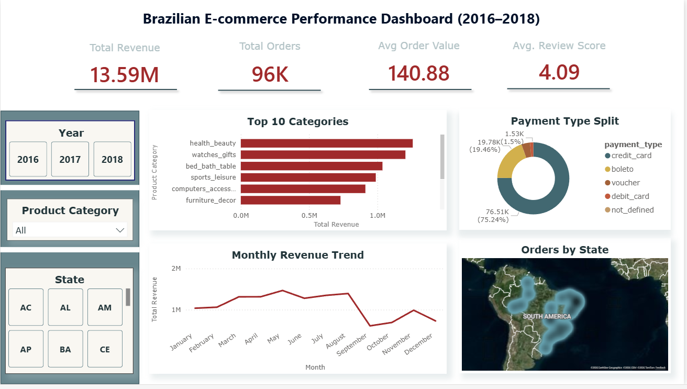
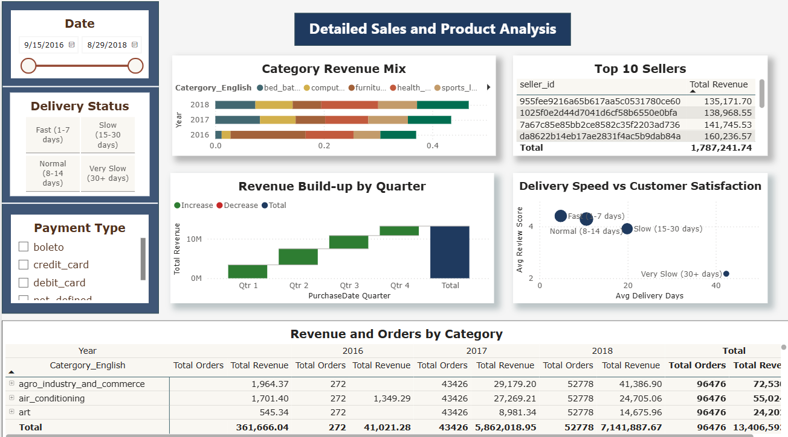
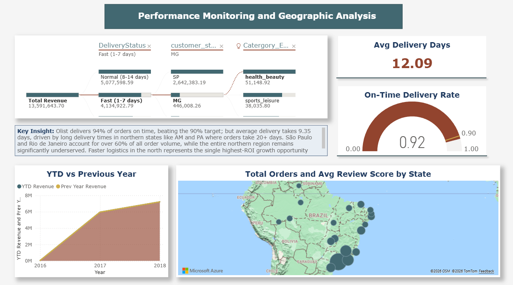

# Brazilian E-Commerce Business Intelligence Dashboard

**DSA 3050A - Business Intelligence and Visualization**
**Faith Mwangi | ID: 954 | USIU-Africa | SS 2026**

## Project Overview

An advanced Power BI analytical solution built on the Olist Brazilian
E-Commerce dataset, covering 99,441 real orders placed across Brazil
between September 2016 and October 2018. The dashboard gives
management, the logistics team and the product team a single platform
to monitor revenue, delivery performance, customer satisfaction and
geographic demand.

---

## Dashboard Preview

### Page 1 - Brazilian E-Commerce Performance Dashboard

### Page 2 - Detailed Sales and Product Analysis

### Page 3 - Performance Monitoring and Geographic Analysis

---

## Problem Statement

This project addresses the following business questions:

1. Which product categories generate the most revenue and is the
   current concentration a strategic risk?
2. How does delivery performance affect customer satisfaction?
3. Which Brazilian states are underserved and represent growth
   opportunity?
4. Is revenue growth sustainable year-over-year?
5. What is driving the mid-2018 revenue slowdown?

---

## Dataset Description

| File | Rows | Key Columns | Role |
|------|------|-------------|------|
| olist_orders_dataset.csv | 99,441 | order_id, customer_id, timestamps | Core fact table |
| olist_order_items_dataset.csv | 112,650 | order_id, product_id, price, freight_value | Revenue fact |
| olist_order_payments_dataset.csv | 103,886 | order_id, payment_type, payment_value | Payment detail |
| olist_order_reviews_dataset.csv | 99,224 | order_id, review_score | Satisfaction |
| olist_products_dataset.csv | 32,951 | product_id, product_category_name | Product dimension |
| olist_customers_dataset.csv | 99,441 | customer_id, customer_state, zip_code_prefix | Customer dimension |
| product_category_name_translation.csv | 71 | category_name, category_name_english | Translation |

**Source:** Kaggle — Brazilian E-Commerce Public Dataset by Olist
**URL:** https://kaggle.com/datasets/olistbr/brazilian-ecommerce
**License:** CC BY-NC-SA 4.0

---

## Tools Used

- Power BI Desktop — Power Query (M), DAX, Report Canvas
- GitHub — version control and project submission
- Microsoft Excel — initial data inspection

---

## Steps Followed

1. Downloaded all 7 CSV files from Kaggle and inspected structures
2. Documented dataset description, business problem and suitability
3. Imported all 8 files into Power BI via Power Query
4. Applied 10 transformation steps including deduplication,
   category translation merge, payment aggregation and delivery columns
5. Built star schema with 2 fact tables, 5 dimension tables and DimDate
6. Created 12 DAX measures and 2 calculated columns in _Measures table
7. Designed 3-page interactive dashboard with 18 visuals total
8. Configured drillthrough, cross-filtering, tooltips and bookmarks
9. Documented 5 insights and 3 actionable recommendations
10. Uploaded all files to GitHub with structured README

---

## Dashboard Features

| Page | Name | Key Visuals |
|------|------|-------------|
| 1 | Executive Summary | 4 KPI cards, monthly line chart, top 10 bar, donut, filled state map, 3 slicers |
| 2 | Detailed Analysis | Matrix drill-down, scatter chart, waterfall, 100% stacked bar, top 10 sellers |
| 3 | Performance and Geography | YTD area chart, on-time gauge, decomposition tree, map, delivery KPI, insight text box |

---

## Key DAX Measures

| Measure | DAX Function | Purpose |
|---------|-------------|---------|
| Total Revenue | SUM | Primary revenue KPI |
| Total Freight Cost | SUM | Logistics cost tracking |
| Total Orders | DISTINCTCOUNT | Order volume KPI |
| Avg Order Value | DIVIDE | Revenue efficiency |
| Avg Review Score | AVERAGE | Customer satisfaction KPI |
| Avg Delivery Days | AVERAGE | Logistics performance KPI |
| YTD Revenue | TOTALYTD | Running year-to-date total |
| Prev Year Revenue | SAMEPERIODLASTYEAR | Year-over-year baseline |
| Revenue YoY Growth % | DIVIDE | Growth trend monitoring |
| Revenue % by Category | DIVIDE + ALL() | Category contribution |
| Category Rank | RANKX | Top/bottom performer identification |
| On-Time Delivery Rate | DIVIDE + FILTER | Logistics target compliance |

---

## Key Insights

1. Top 3 categories account for 35%+ of revenue - concentration risk
2. Delivery under 7 days averages a review score above 4.2, over 20 days drops below 3.0
3. São Paulo accounts for 40%+ of orders while northern states are severely underserved
4. Over 73% of orders use credit card installment plans
5. 2018 revenue slowdown is concentrated in electronics, not platform-wide

---

## Challenges Encountered

- Product category names were in Portuguese, so I merged translation table in Power Query
- Payments had multiple rows per order_id, I grouped by order_id and summed values
- Null delivery dates on some delivered orders, I filtered out in Power Query
- DimDate required marking as Date Table for time intelligence functions to work
- All relationships set to Single cross-filter direction to avoid circular dependency errors

---

## Conclusion

The dashboard transforms 7 raw CSV files into a complete BI solution
giving management actionable intelligence on revenue, logistics,
satisfaction and geography. The most significant finding is that
delivery time directly determines customer satisfaction, and the
geographic analysis shows a clear opportunity to grow order volumes
in underserved northern states.

---

## PDF Report

Full project report available in the /report folder.

---
Faith Mwangi
muthoninduta@gmail.com

*Dataset by Olist via Kaggle · CC BY-NC-SA 4.0*
*Built for DSA 3050A End Semester Examination · USIU-Africa* 